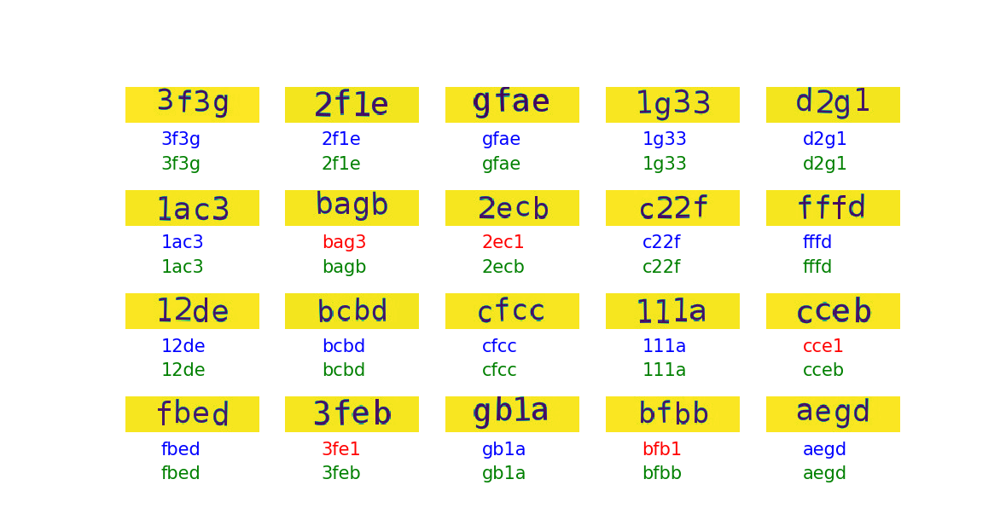

# Captcha-recognition-Keras

A cool project using deep learning to decaptcha




## Getting Started

Project using deep learing with Keras + Tensorflow framework to recognition multi-digit captcha.
Using convolutional neural network, this project is so powerful but also requires a lot of data.
Data is captchas generated by [Captcha-php](https://github.com/dukn/Captcha-php).
You can modify 2 `Captcha_Generator/Captcha-php/CaptchaBuilder.php` and `Captcha_Generator/Captcha-php/PhraseBuilder.php` files to create more difficult captcha.

In this project, I have 3 main file:
- `Preprocessing.py`: Read image data and prepare for training.
- `Train.py`: Training model.
- `Recognition.py`: Recognition captcha.

### Prerequisites

<!-- What things you need to install the software and how to install them-->
You must have knowledge of deep learning and Keras/Tensorflow to understand it.
Also you need to install the following libs:

```
Python2.7
Keras 2.1.5
Tensorflow 1.4.0
Numpy 1.14.1
Pickle
Matplotlib
Scipy
```

### Installing

Here I will direct you to install on linux (Ubuntu).
You can do the same on Windows and MacOS yourself.

Install tensorflow, you can follow the detailed instructions [here](https://www.tensorflow.org/install/install_linux)
or below:
```
$ sudo apt-get install python-pip python-dev   # for Python 2.7
$ sudo pip install tensorflow      # Python 2.7; CPU support (no GPU support)
$ pip install keras # install Keras
```

Install Numpy and Scipy

```
$ sudo pip install numpy scipy
```

Install cPickle :
```
$ sudo pip install cpickle
```

Install Matplotlib:
```
$ sudo apt-get install python-matplotlib
```

It's so easy!

## Running the tests

Generated Captchas and put them at `./Data/` and lable at `./Data/pass.txt`.

```
$ make clean # clean old data
$ make captcha # create new data
```

Preprocessing data
```
$ make preprocessing
```

Train model by run `Train.py`:
```
$ make train
```
The model will automatically save after the train finished.
You can break with `Ctrl + C` whenever you want.


Recognition by run `Recognition.py`:
```
$ make recognition
```

Show tensorboard:

```
$ tensorboard --logdir ./logs
```

<!--
### Break down into end to end tests

Explain what these tests test and why

```
Give an example
```

### And coding style tests

Explain what these tests test and why

```
Give an example
```

## Deployment

Add additional notes about how to deploy this on a live system

## Built With

* [Dropwizard](http://www.dropwizard.io/1.0.2/docs/) - The web framework used
* [Maven](https://maven.apache.org/) - Dependency Management
* [ROME](https://rometools.github.io/rome/) - Used to generate RSS Feeds

## Contributing

Please read [CONTRIBUTING.md](https://gist.github.com/PurpleBooth/b24679402957c63ec426) for details on our code of conduct, and the process for submitting pull requests to us.

## Versioning

We use [SemVer](http://semver.org/) for versioning. For the versions available, see the [tags on this repository](https://github.com/your/project/tags).
-->

## Authors

* **Dukn** - *Initial work* - [Dukn](https://github.com/dukn)

<!-- See also the list of [contributors](https://github.com/your/project/contributors) who participated in this project. -->

<!--
## License

This project is licensed under the MIT License - see the [LICENSE.md](LICENSE.md) file for details
-->
## TOOLS

* Deep leaning for computer vision
* Keras + Tensorflow framework
* Python
